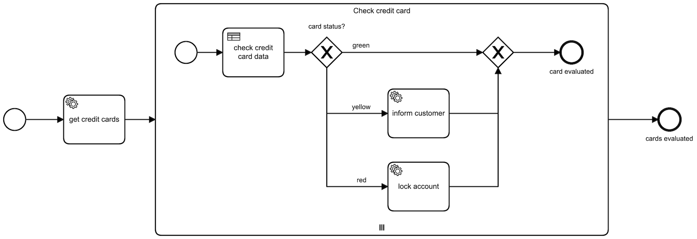

## Camunda Credit Card Checker
BPMN offers the possibility to run multiple tasks in parallel, iterating over a list of objects

## Scenario
This process iterates over a huge amount of existing customer credit cards and checks if they are expired to either 
inform the customer to update it or lock the account

Note: true parallelism is hard to achieve when camunda writes into the same tables where locking happens -> therefore 
all instances run exclusive in this case

The respective dmn table returns a status code red, yellow or green based on the expiration days:

- green: 90+ days left
- yellow: between 0 and 90 days left
- red: expired (negative days)

## Execution
- start the application by running `./gradlew bootRun`
- go to `localhost:8083` and login as `admin:admin`
- start a task from the task list and check the log output
- if you have an enterprise licence you can also check the task history in the cockpit app

NOTE: the credit card data is just randomly generated numbers, no actual credit card data is used here

## Dependencies
- Camunda BPM 7.15
- Spring Boot 2.4
- Java 11
- Apache Commons Lang 3.12
- H2 Database 1.4.200
